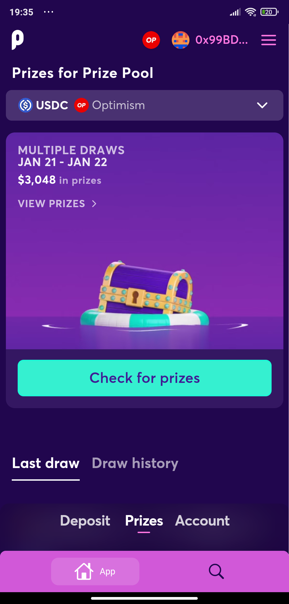
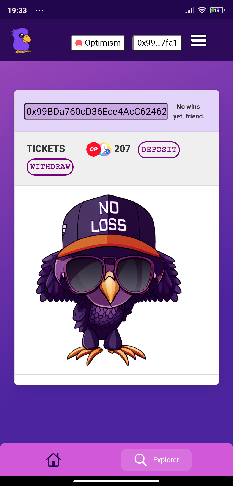

# Pooltogether App

## About

A Flutter app for [PoolTogether](https://app.pooltogether.com/fr), made using a WebView.

This also fully works with [WalletConnect](https://walletconnect.org/) and [Coinbase Wallet](https://wallet.coinbase.com/).

A full integration of [PoolExplorer](https://poolexplorer.win/) has been done to display the last winnings.

This is an Unofficial app, not affiliated with PoolTogether.

## Features

Wallet connection is working perfectly with WalletConnect and Coinbase Wallet if you have any wallet app on your mobile.

Cookies and cache are kept on app close to keep you logged in.

## What's next

- [ ] Add a way to display notifications from the app when your win a prize.
- [ ] Pre-load 3 main pages to make the app smoother (deposit, prize, acount).
- [ ] Add ipa for iOS users.
- [ ] Add a page with all last winnings (what about creating this page in the original app ?).

## Miscellanous

Since this app is not supported by PoolTogether, Android and iOS users will have to install the app manually.

All rights reserved to [PoolTogether](https://github.com/pooltogether).
